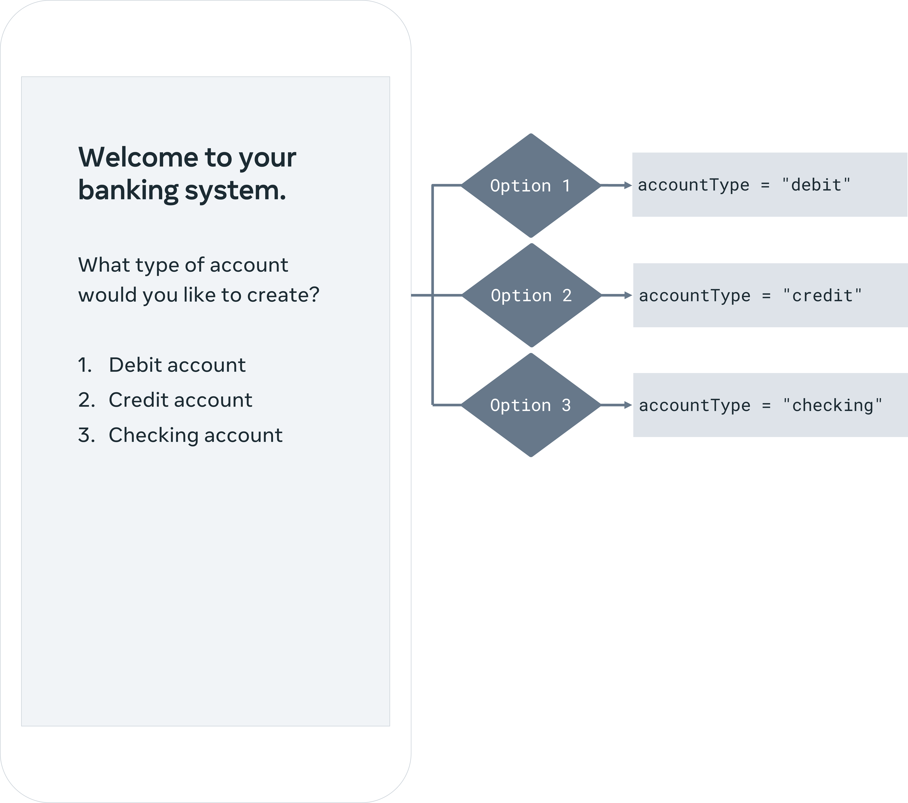
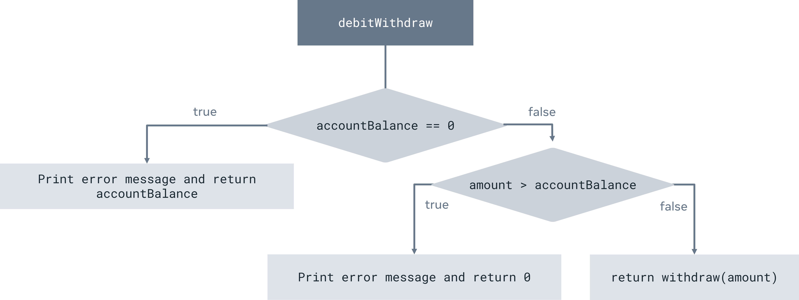
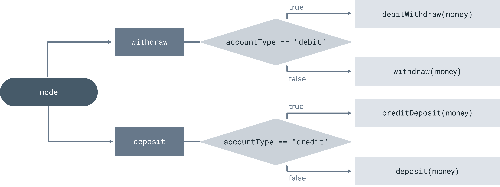
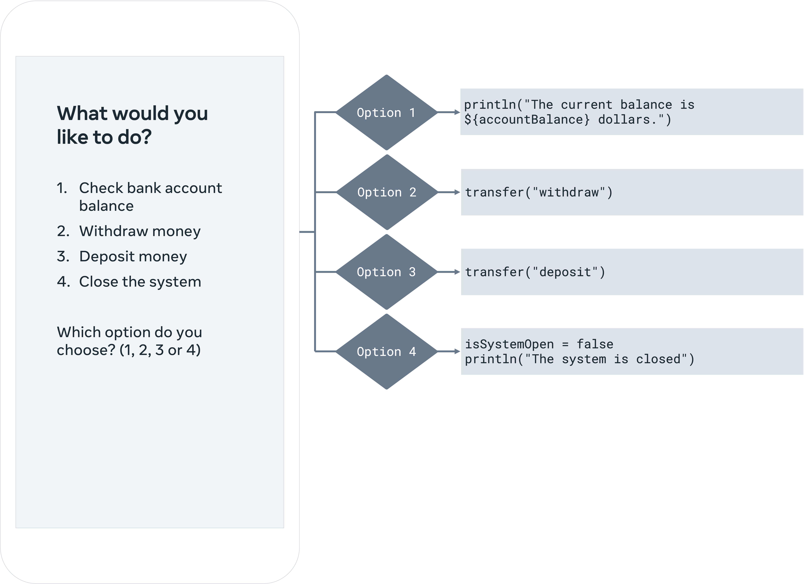

# BankAccount

The project is divided into three parts. Each part gives you full guidance, feedback and solutions.
The sequence and the content of the three project parts simulate the type of software development progression that would happen in a real-world build of such an app.

## Part 1: Build the visual user interface (UI) and set up accounts

In this first part, you will create the app to allow a user to choose from three different bank account types: credit, debit and checking. This work includes:

Print the names of the three bank account types to the console. 

Use loops to create a new bank account based on the user’s choice. 

Use a when expression to validate user input and select the required bank account type. 

## Part 2: Define bank account operations

For each account type, configure the app to operate the deposit and withdrawal of funds. 

Use functions to create valid and appropriate bank account operations based on the bank account types. 

Configure conditional statements to implement the logic of withdrawals and deposits in bank accounts. 

## Part 3: Manage the bank account

After a bank account is created and operations are defined, process user input commands to manage a bank account.

Use functions to manage money withdrawals and deposits. 

Use loops to process multiple user commands for the given bank account. 

For a money transfer, use conditional statements to select the bank account’s operation based on the bank account’s type. 

Use when expressions to choose the right bank account operation from the list of valid bank account operations. 

## Manage the bank account based on the user interface option

